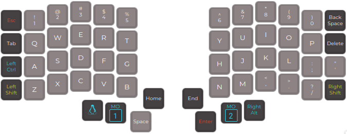
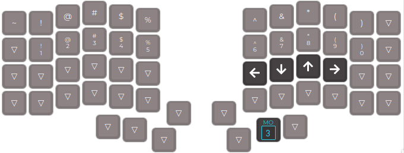
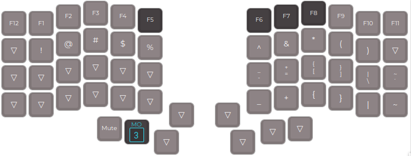
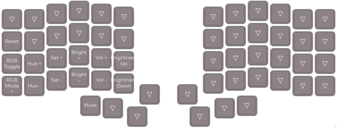

# keebio_iris_rev7_layout


| Layer 0 (text) | layer 1 (movement) | Layer 2 (symbols) | Layer 3 (media)
|:-------------------------:|:-------------------------:|:-------------------------:|:-------------------------:|
|| |||

## install

* flash the keyboard (do for each half)
```
qmk flash -kb keebio/iris/rev7 keebio_iris_rev7_layout/keebio_iris_rev7_layout.json
```
