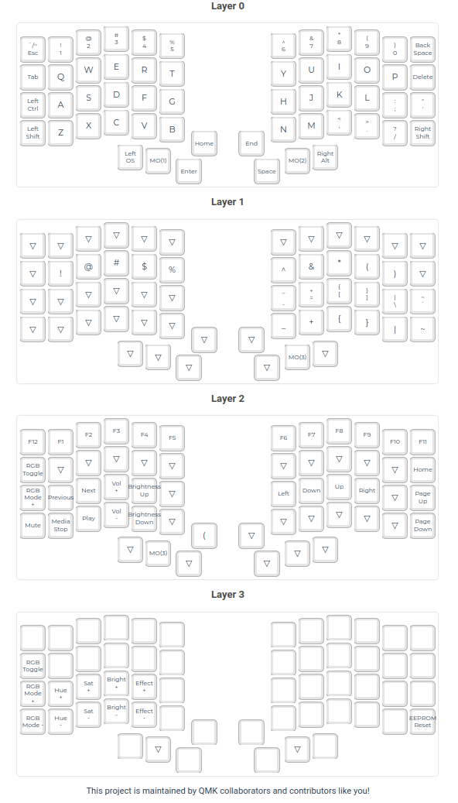

# keebio_iris_rev7_layout


## install

* install qmk
```
sudo pacman -S qmk
qmk setup
```

* flash the keyboard (do for each half)
```
qmk flash -kb keebio/iris/rev7 keebio_iris_rev7_layout/keebio_iris_rev7_layout.json
```

## Troubleshooting

You messed up somehow and one half is briked, see https://github.com/qmk/qmk_firmware/issues/22472
```
dfu-programmer atmega32u4 erase --force
```
