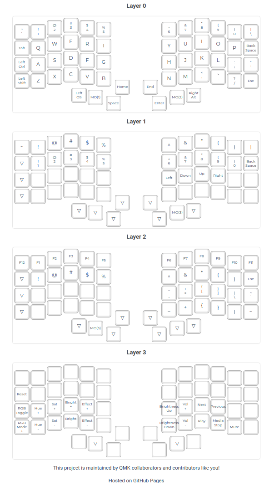

# keebio_iris_rev7_layout



Create your layout or edit this one by importing the .json file into [config.qmk.fm](https://config.qmk.fm/)

## install 

* install qmk:
```
sudo pacman -S qmk
qmk setup
```

* flash the keyboard (do for each half):
```
qmk flash -kb keebio/iris/rev7 keebio_iris_rev7_layout/keebio_iris_rev7_layout.json
```
OR if you compile on [QMK configurator](https://config.qmk.fm/#/keebio/iris/rev7/LAYOUT):
```
qmk flash <path-to-file>.hex
```

## Troubleshooting

You messed up somehow and one half is bricked, see https://github.com/qmk/qmk_firmware/issues/22472
```
dfu-programmer atmega32u4 erase --force
```
